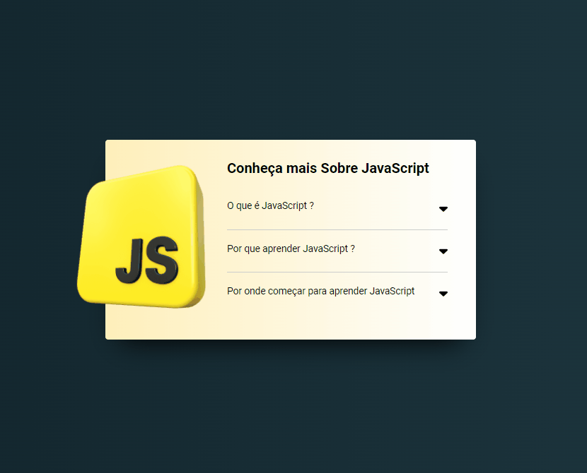

# Meu acordeon-JS

## Sumário

- [Sobre o projeto](#sobreoprojeto)
- [Layout  desktop](#layout-desktop)
- [Tecnologias utilizadas](#tecnologias-utilizadas)
- [O que eu aprendi](#o-que-eu-aprendi)
- [Acesso a página](#acesso-a-página)

## Sobre o projeto

Esse projeto se trata de um acordeon, onde ao clicar em uma pergunta acontece uma animação para abrir o item e mostrar o texto escondido, com isso seta muda de direção e de cor. Também é possível acessar outra pergunta ao clicar, com isso será fechada a pergunta anterior e aberta a nova pergunta, contudo também é possível fechar a pergunta em sua própria seta. Este projeto é um aprimoramento do meu primeiro acondeon que você pode ter acesso [clicando aqui ](https://github.com/ClariCassia/acordeon-simples-JS)
 
 

## Layout desktop    

 

 
 
 

## Tecnologias utilizadas

- HTML
- CSS
- JS

## O que eu aprendi

Neste projeto, aprimorei os conhecimentos CSS, onde nele pude utilizar o font awesome, ferramenta que facilita a manipulação de icones. Nele também pude colocar em prática a manipulação do DOM, adicionando e removendo classes através do JS, exercitando a lógica utilizando for e addEventListener.

## Acesso a página

Para ver o projeto pronto [clique aqui ](https://claricassia.github.io/Meu-acordeon-JS/)
